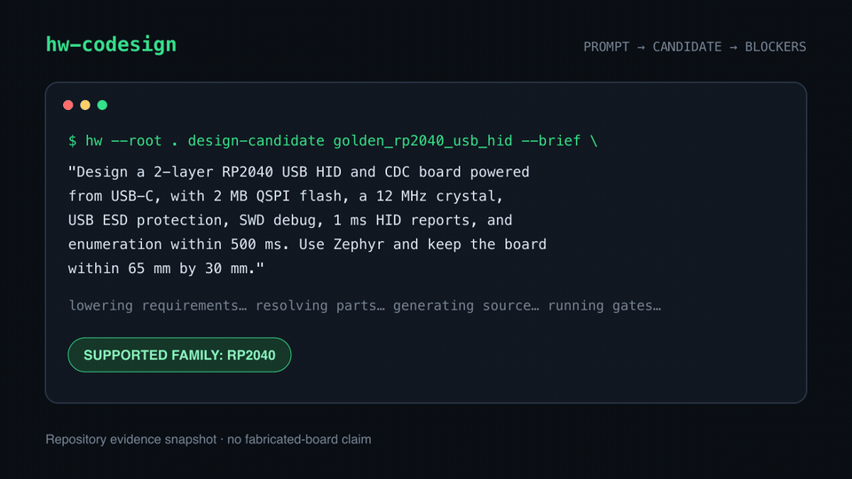

# hw-codesign

[](https://github.com/mrcha033/hw-codesign/actions/workflows/ci.yml)
[](LICENSE)

**For supported board families, turn an agent brief into a reviewable hardware candidate and an explicit fabrication-blocker report.**

[](docs/demo/README.md)

[Download the self-contained read-only review](docs/demo/index.html) ·
[inspect the demo evidence and hashes](docs/demo/README.md) ·
[read the validation contract](docs/validation-contract.md)

<!-- golden-demo-evidence:start -->
The demo is a dated full-toolchain repository run against the RP2040 USB-device
family. It produced a candidate, not a fabrication-qualified board: 44 of 48
recorded gates passed, 1 failed, and 3 were blocked. Freerouting reports zero
raw unrouted connections and KiCad reports zero post-fill unconnected items;
native ERC and DRC each report zero violations. The native Zephyr build is
blocked because the selected ARM toolchain lacks newlib runtime files.

The remaining evidence is material: sourcing fails, current supplier
availability is blocked, the native Zephyr build is blocked on ARM newlib, and
physical qualification is blocked. The
board has not been fabricated, and the U2.57 via-in-pad fill/cap/tent process is
unqualified. Bundle `7d6731501a24716965593f7fcdc168a3d739d1b0a1b7a57f7a0b29fee51c1b84` records those boundaries.
<!-- golden-demo-evidence:end -->

## The 20-second product loop

| Brief | Candidate | Blocker report |
|---|---|---|
| Natural-language constraints are lowered into typed project fields with provenance. | The run emits electronics source, KiCad artifacts, firmware, BOM, review bundle, and hashes. | Every gate is `pass`, `fail`, or `blocked`; physical evidence gaps stay release-blocking. |

`hw-codesign` is available as a CLI (`hw`), an MCP server (`hw-mcp`), and a
repository-owned agent plugin. Its design surface is template- and
contract-driven. It is not an arbitrary-prompt PCB oracle.

## Install from source

Python 3.11 or newer is required.

```bash
git clone https://github.com/mrcha033/hw-codesign.git
cd hw-codesign
python3.11 -m venv .venv
.venv/bin/pip install '.[mcp]'
export PATH="$PWD/.venv/bin:$PATH"
hw --help
```

This source checkout is the only currently verified public installation route.
The self-contained review is also live at
https://mrcha033.github.io/hw-codesign/. No package index, container registry, or
tagged release is claimed until that endpoint is live and independently
smoke-tested.

Create the same candidate class used in the demo:

```bash
mkdir my-hardware-workspace
cd my-hardware-workspace

hw --root . create-project my_usb_board --template rp2040_usb_device
hw --root . update-requirements my_usb_board \
  "Design a 2-layer RP2040 USB HID and CDC board powered from USB-C. Use Zephyr."
hw --root . design-candidate my_usb_board --brief \
  "Design a 2-layer RP2040 USB HID and CDC board powered from USB-C. Use Zephyr."
hw --root . export-standalone-review my_usb_board
```

The generated HTML review is self-contained. No receiver or cloud account is
required to inspect it.

### MCP clients

Claude Desktop configuration:

```json
{
  "mcpServers": {
    "hw-codesign": {
      "command": "/absolute/path/to/hw-codesign/.venv/bin/hw-mcp",
      "args": [],
      "env": {
        "HW_PLATFORM_ROOT": "/absolute/path/to/a/writable/hardware-workspace"
      }
    }
  }
}
```

Claude Code:

```bash
claude mcp add hw-codesign \
  -e HW_PLATFORM_ROOT="$PWD" \
  -- /absolute/path/to/hw-codesign/.venv/bin/hw-mcp
```

For Codex or Claude plugin use, clone this repository and install the
`hw-codesign` marketplace entry:

```bash
codex plugin marketplace add /absolute/path/to/hw-codesign
codex plugin add hw-codesign@hw-codesign
```

## What the statuses mean

| Status | Meaning |
|---|---|
| `pass` | The named gate ran and its declared checks passed. |
| `fail` | The gate ran and found a concrete defect or unmet contract. |
| `blocked` | Evidence or a required tool/input is missing. This is never treated as pass. |
| `candidate` | Reviewable generated artifacts exist, but release promotion is not authorized. |
| `released` | The configured release gate passed and the release bundle was exported. This does not imply physical qualification unless physical evidence is present and approved. |

Every public tool response carries `release_eligible`, `candidate_only`, and
`release_blocking_failures`. Only the release-gate and release-export paths can
set `release_eligible: true`.

## Supported board families

All 13 shipped templates conform to the current typed spec schema. Their design
and physical maturity are not identical; inspect each candidate's gate report.

| Group | Templates |
|---|---|
| USB devices | `rp2040_usb_device`, `usb_hid_controller`, `avr_32u4_hid`, `nrf52840_dongle` |
| Sensors and gateways | `ble_sensor_node`, `sensor_data_logger`, `lora_sensor_node`, `esp32_wifi_gateway`, `samd21_sensor_hub`, `stm32g0_power_monitor` |
| Robotics and power | `robotics_controller_full`, `mini_servo_robot`, `bldc_esc` |

Use `hw diagnose-environment` to inspect the installed native backends, or see
[Adapting the design system](docs/adapting-a-spec.md) before adding a materially
different topology.

## Agent workflow

The MCP names use the same lifecycle as the CLI:

```text
hw_get_capabilities
  → hw_create_project
  → hw_update_requirements
  → hw_design_candidate
  → hw_check_cross_domain_consistency
  → hw_generate_physical_qualification_plan
  → hw_record_physical_evidence
  → hw_check_release_gate
  → hw_export_release_bundle
```

Agents can also author circuit blocks, placement constraints, and firmware
modules, explore alternatives, compare candidates, and run adversarial grounding
benchmarks. See the [MCP tool reference](docs/mcp-tools.md) for the complete
contract.

## Repository map

| Path | Purpose |
|---|---|
| `src/hw_codesign/` | CLI, MCP service, generators, validators, and review UI |
| `src/hw_codesign/templates/` | Supported family specifications |
| `parts/` | Curated components, role sets, supplier records, and datasheet evidence |
| `projects/golden_rp2040_usb_hid/` | Date-stamped golden candidate and current evidence gaps |
| `docs/demo/` | 20-second demo and self-contained read-only review |
| `schemas/` | Typed project and result contracts |
| `tests/` | Cross-platform regression and evidence-boundary tests |

## Development

```bash
python3.11 -m venv .venv
.venv/bin/pip install '.[dev,mcp]'
npm ci --ignore-scripts
pytest -q
ruff check .
```

Native gates require their corresponding tools. Diagnose the current machine
before interpreting a blocked result:

```bash
hw diagnose-environment --target fabrication_release --backend kicad
hw check my_usb_board
```

See [CONTRIBUTING.md](CONTRIBUTING.md) for contribution scope, tests, and claim
boundaries. Security reports should follow [SECURITY.md](SECURITY.md).

## Known limits

- Generated artifacts remain candidates until every configured release gate
  passes. A Gerber ZIP is not proof that a board is safe or manufacturable.
- Digital checks cannot certify thermal performance, EMI/EMC, vibration,
  ingress, abuse safety, connector life, assembly quality, or electrical
  bring-up. Those require traceable physical evidence.
- The RP2040 golden candidate has not yet been fabricated. Its current blocker
  report is published deliberately, and no bench measurements are claimed.
- Supplier catalog entries identify parts and provenance, but current stock and
  alternates require fresh supplier evidence.
- The receiver binds only to loopback. Remote use requires an authenticated SSH
  tunnel or reverse proxy; it is not a multi-tenant hosted service.

## License

The project is licensed under [Apache-2.0](LICENSE). The vendored KiCad footprint
under `src/hw_codesign/footprints/` retains its CC-BY-SA 4.0 license with the
KiCad libraries exception; see [NOTICE](NOTICE) for the boundary.
